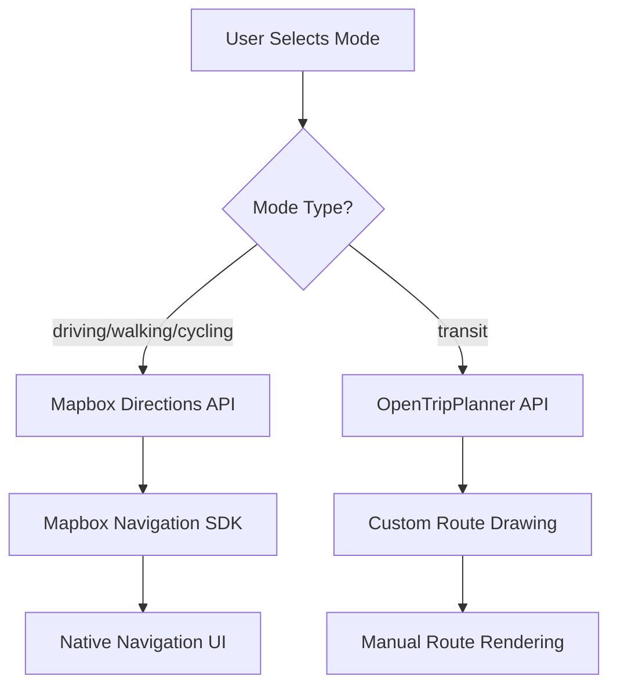

# Directions & Routing Architecture

This document explains how the directions and routing system works in the application, specifically the hybrid approach using Mapbox Navigation SDK for standard modes and custom implementation for transit.

## Overview

The application uses a hybrid routing approach:

1. **Mapbox Navigation SDK** - Used for driving, walking, and cycling routes with native turn-by-turn navigation
2. **OpenTripPlanner (OTP)** - Used for public transit routes with custom rendering

## Key Components

### 1. Route Mode Selection
- The routing mode is managed by `DirectionsModeContext` 
- Available modes: `driving`, `walking`, `cycling`, `transit`
- The mode determines which routing system is used

### 2. Routing Flow



### 3. Implementation Strategy

#### For Non-Transit Modes (Driving/Walking/Cycling)
- **Routing**: Mapbox Directions API
- **Rendering**: Mapbox GL Directions Plugin
- **Features**:
  - Native turn-by-turn navigation UI
  - Automatic route line rendering with alternatives
  - Built-in route interaction (though disabled in our implementation)
  - Professional navigation experience

#### For Transit Mode
- **Routing**: OpenTripPlanner (OTP)
- **Rendering**: Custom Source/Layer components
- **Features**:
  - Multi-modal journey planning (walk + transit)
  - Custom route visualization
  - Transit-specific information display

### 4. Route Storage
- All routes are stored in the `TransitStore` using a unified structure
- Routes have a `mapboxRoute` property that contains the route data
- The route structure is the same regardless of the source

## Implementation Details

### Mapbox Navigation SDK Integration
```typescript
// Only active for non-transit modes when route exists
if (mode !== 'transit' && routeStartCoords && routeEndCoords && mapboxDirectionsRoute) {
  const ctrl = new MapboxDirections({
    accessToken: MAPBOX_ACCESS_TOKEN,
    unit: 'metric',
    profile: `mapbox/${mode}`,
    controls: { 
      inputs: false,      // We handle inputs in sidebar
      instructions: false, // We show instructions in sidebar
      profileSwitcher: false
    },
    alternatives: true,
    interactive: false
  });
}
```

### Custom Transit Rendering
```typescript
// Manual route drawing only for transit mode
const directionsRouteLine = React.useMemo(() => {
  if (!mapboxDirectionsRoute?.geometry || mode !== 'transit') return null;
  return {
    type: 'Feature',
    properties: { source: 'directions' },
    geometry: mapboxDirectionsRoute.geometry
  };
}, [mapboxDirectionsRoute?.geometry, mode]);
```

## UI Behavior

### Route Display Logic
- **Non-Transit Modes**: Mapbox Navigation SDK handles all rendering
- **Transit Mode**: Custom rendering with our Source/Layer components
- **OBA Routes**: Always use custom rendering

### Alternative Routes
- **Non-Transit**: Handled by Mapbox Navigation SDK
- **Transit**: No alternatives (OTP limitation)

### Visual Differentiation
- Primary routes: Blue (#3b82f6) with 6px width
- Alternative routes: Gray (#6b7280) with dashed line
- Transit routes: Black with custom styling

## Benefits of This Approach

1. **Best of Both Worlds**: Professional navigation for standard modes, custom control for transit
2. **Consistency**: Unified data structure despite different rendering methods
3. **Performance**: Native SDK optimization for non-transit navigation
4. **Flexibility**: Full control over transit route visualization

## Future Enhancements

1. **Navigation SDK v3**: Upgrade to latest Mapbox Navigation SDK when stable
2. **Transit Navigation**: Implement turn-by-turn transit guidance
3. **Unified Experience**: Gradually align transit UI with native navigation patterns

## Common Issues & Solutions

### Issue: Tabs not showing for transit routes
**Cause**: Transit routes from OTP don't have alternatives  
**Solution**: This is expected behavior. The UI now clarifies when it's a transit route

### Issue: Confusion between routing systems
**Cause**: Both systems return similar data structures but with different capabilities  
**Solution**: The mode context clearly separates which system is being used

## Future Improvements

1. **Transit Alternatives**: Could query OTP for multiple departure times or route options
2. **Unified Alternatives**: Present transit options alongside driving/walking options
3. **Mode Comparison**: Show time/cost comparisons between different modes 